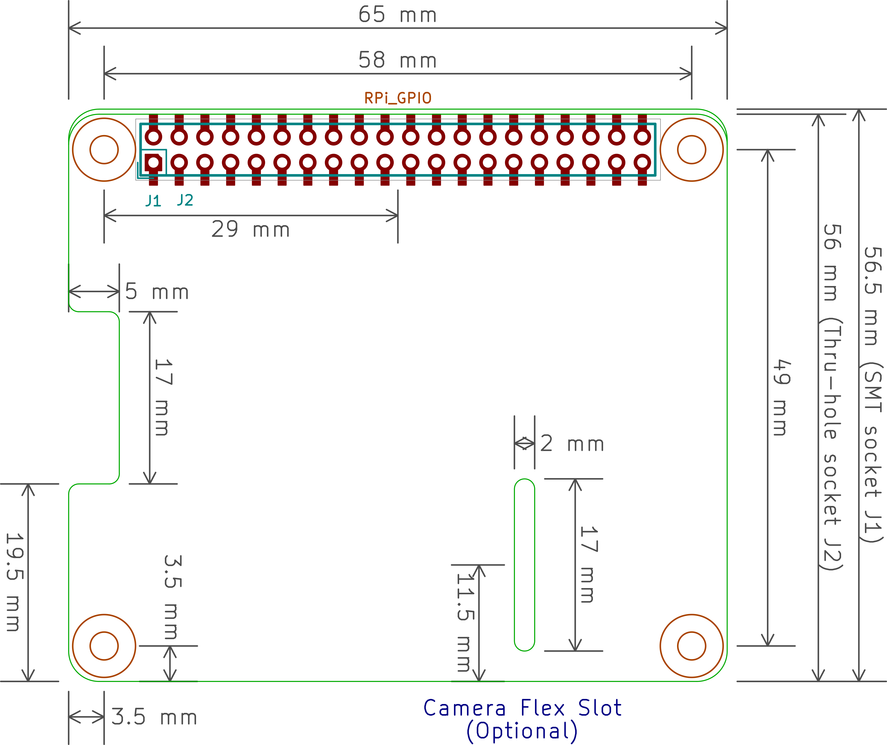

Raspberry Pi B+ Hat
============================

Expansion Board
----------------------------

This is a project template for a 
[Raspberry Pi B+ Hat](https://github.com/raspberrypi/hats).

This base project includes a PCB edge defined according to 
[this specification](https://github.com/raspberrypi/hats/blob/master/hat-board-mechanical.pdf).
Both a thru-hole and a surface mount connector are provided, along with a different
PCB edge for each. Just keep the PCB edge and connector type that you're using for your design
and delete the others.

The component footprints used in this template are [here](https://github.com/devbisme/RPi_Hat.pretty).

The board outline looks like this:



Using this template
----------------------------

To use the Raspberry Pi Hat template, do one of following:


### Clone this repo as a submodule

```shell
mkdir -p my_project/libraries && cd my_project/libraries
git submodule add https://github.com/devbisme/RPi_Hat_Template
```

### Download this repo directly

Not recommended because you loose version control tracking,

Download the .zip from [here](https://github.com/devbisme/RPi_Hat_Template/archive/refs/heads/master.zip) and save
it to your system


### Import the library into KiCAD

In KiCAD go to `Preferences > Manage Symbol Libraries` and add the symbol library `libraries/RPI_Hat.kicad_sym`  
In KiCAD go to `Preferences > Manage Footprint Libraries` and add the footprint library `footprints/RPI_Hat.pretty/`  

(c)2015-2021 Dave Vandenbout.
